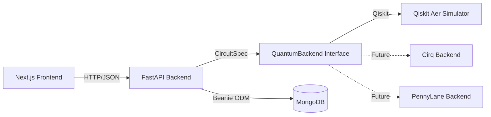

<div align="center">

# ⚛️ Qwearn

**An open-source, interactive quantum computing learning platform.**

Learn quantum computing by building circuits, not just reading about them.

[](LICENSE)
[](.github/workflows/ci.yml)

</div>

---

## What is Qwearn?

Qwearn takes you from "what is a qubit?" to "I built and understood Grover's algorithm" through a guided, interactive experience. Every concept follows the same learning loop:

**Explanation → Math → Animation → Live Code → Quiz → Practice**

The core differentiator is the **Circuit Playground**: a drag-and-drop circuit builder that generates real Qiskit code and runs it on a real simulator. Nothing in the learning experience is fake or pre-baked — every circuit you build actually executes.

### Key Features

- 🔧 **Circuit Playground** — Drag-and-drop circuit builder with live Qiskit code generation
- 📚 **Guided Lessons** — 7 quantum gate lessons (X, Y, Z, H, Phase, CNOT, Toffoli) with interactive exercises
- 🧮 **Algorithm Library** — Step-through animations of Grover's, Shor's, QFT, and more
- 🏆 **Challenges** — Build circuits to match target quantum states, with automatic evaluation
- 🔬 **Research Hub** — Curated quantum computing resources and papers
- 🌐 **Bloch Sphere** — 3D visualization of qubit states

---

## Quick Start

### Prerequisites

- [Docker](https://docs.docker.com/get-docker/) and [Docker Compose](https://docs.docker.com/compose/install/)
- [Node.js 18+](https://nodejs.org/) and [pnpm](https://pnpm.io/) (for local development without Docker)
- [Python 3.11+](https://www.python.org/) (for backend development)

### Run with Docker (Recommended)

```bash
# Clone the repository
git clone https://github.com/qwearn-org/qwearn.git
cd qwearn

# Start all services
docker-compose up --build

# The app is now running:
#   Frontend: http://localhost:3000
#   API:      http://localhost:8000
#   API Docs: http://localhost:8000/docs
#   MongoDB:  mongodb://localhost:27017
```

### Run Locally (Development)

```bash
# 1. Install frontend dependencies
pnpm install

# 2. Start the Next.js frontend
pnpm dev  # → http://localhost:3000

# 3. In a separate terminal, set up the Python backend
cd apps/api
python3 -m venv .venv
source .venv/bin/activate
pip install -e ".[dev]"
pip install -e ../../packages/quantum-core
uvicorn app.main:app --reload --port 8000  # → http://localhost:8000

# 4. Start MongoDB (via Docker or local install)
docker run -d -p 27017:27017 --name qwearn-mongo mongo:7
```

---

## Project Structure

```
qwearn/
├── apps/
│   ├── web/                 # Next.js frontend (App Router, TypeScript, Tailwind)
│   └── api/                 # FastAPI backend (Python 3.11+, Beanie ODM)
├── packages/
│   ├── quantum-core/        # Qiskit abstraction layer (QuantumBackend interface)
│   └── ui/                  # Shared React component library
├── content/
│   ├── lessons/             # Structured lesson content (Markdown + JSON)
│   ├── algorithms/          # Algorithm module content
│   └── challenges/          # Challenge definitions + evaluator specs
├── docs/
│   ├── architecture/        # System design docs with diagrams
│   ├── adr/                 # Architecture Decision Records
│   ├── api-reference/       # API documentation
│   └── contributing/        # Contributor guides
├── infra/
│   ├── docker/              # Dockerfiles for web and api
│   └── github-actions/      # CI/CD workflows
├── docker-compose.yml       # Local dev: web + api + mongo
├── turbo.json               # Turborepo pipeline config
└── pnpm-workspace.yaml      # pnpm workspace config
```

Each folder has its own `README.md` explaining scope and architecture decisions. Start with the one closest to what you want to work on.

---

## Tech Stack

| Layer | Technology | Why |
|---|---|---|
| Frontend | Next.js 14+ (App Router), React, TypeScript | SSR + App Router for SEO and performance |
| Styling | Tailwind CSS | Rapid UI development with design tokens |
| Circuit Builder | React Flow | Custom node types for quantum gates |
| Backend | FastAPI (Python 3.11+) | Async, Pydantic v2 models, auto-generated API docs |
| Quantum Engine | Qiskit + Qiskit Aer | Industry-standard SDK, wrapped behind `QuantumBackend` |
| Database | MongoDB (via Beanie ODM) | Flexible schema for user progress, circuit saves |
| Auth | Auth.js (NextAuth v5) | Self-hosted, OSS-friendly, MongoDB adapter |
| Monorepo | Turborepo + pnpm workspaces | Task caching, dependency orchestration |
| CI/CD | GitHub Actions | Lint, typecheck, test, build on every PR |

---

## Architecture

The system follows a clean separation:



The `QuantumBackend` interface is the critical architectural seam — it ensures the API layer never imports a specific quantum SDK. See [ADR-0005](docs/adr/ADR-0005-quantum-backend-interface.md) for the full design rationale.

---

## Documentation

| Document | What it covers |
|---|---|
| [Architecture Decision Records](docs/adr/) | Why we made each non-trivial technical decision |
| [Contributing Guide](CONTRIBUTING.md) | How to set up, develop, test, and submit PRs |
| [Code of Conduct](CODE_OF_CONDUCT.md) | Community standards |
| [Implementation Plan](IMPLEMENTATION_PLAN.md) | Full build plan with phases and module breakdown |

---

## Contributing

We welcome contributions! Please read [CONTRIBUTING.md](CONTRIBUTING.md) for:

- Local development setup
- Code style and conventions
- How to add new lessons and algorithms
- PR process and review expectations

---

## Roadmap

See [IMPLEMENTATION_PLAN.md](IMPLEMENTATION_PLAN.md) for the full phased build plan. Current status:

- [x] **Phase 0** — Foundations (repo scaffolding, CI, docs)
- [x] **Phase 1** — Circuit Playground (drag-and-drop builder + simulator)
- [ ] **Phase 2** — Learn Module (7 gate lessons)
- [ ] **Phase 3** — Quantum Algorithms (Grover's, Shor's, etc.)
- [ ] **Phase 4** — Challenges (auto-evaluated circuit problems)
- [ ] **Phase 5** — Quantum Machine Learning
- [ ] **Phase 6** — Research Hub
- [ ] **Phase 7** — 3D Bloch Sphere Upgrade
- [ ] **Phase 8** — Hardening (auth, accessibility, security)
- [ ] **Phase 9** — Plugin System (multi-SDK support)

---

## License

[MIT](LICENSE) — use it, fork it, learn from it, teach with it.
