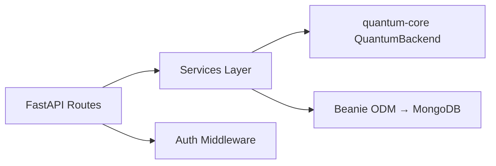

# apps/api — FastAPI Backend

The Qwearn API server, built with FastAPI (Python 3.11+), Beanie ODM, and Pydantic v2.

## Scope

This package is responsible for:
- **Circuit Execution** — Accepts circuit specs from the frontend, delegates to `quantum-core`, returns results
- **Bloch Sphere Data** — Computes Bloch sphere coordinates from statevectors
- **User Data** — CRUD for user profiles, lesson progress, circuit saves, challenge submissions
- **Content Serving** — Serves lesson/algorithm/challenge content to the frontend
- **Auth Validation** — Validates JWT tokens from Auth.js for protected endpoints

## Architecture



The API layer is **SDK-agnostic** — it never imports Qiskit or any quantum SDK directly. All quantum operations go through the `QuantumBackend` interface in `packages/quantum-core`.

## Local Development

```bash
cd apps/api
python3 -m venv .venv
source .venv/bin/activate
pip install -e ".[dev]"
pip install -e ../../packages/quantum-core

# Start MongoDB
docker run -d -p 27017:27017 --name qwearn-mongo mongo:7

# Run the server
uvicorn app.main:app --reload --port 8000
# → API: http://localhost:8000
# → Docs: http://localhost:8000/docs
```

## Key Directories

```
app/
├── main.py           # FastAPI app setup, lifespan, middleware
├── routers/          # Route handlers (health, circuits, lessons, etc.)
├── models/           # Beanie document models + Pydantic schemas
└── services/         # Business logic (circuit execution, progress tracking)
tests/
└── test_health.py    # API endpoint tests
```

## Environment Variables

| Variable | Description | Default |
|---|---|---|
| `MONGODB_URL` | MongoDB connection string | `mongodb://localhost:27017` |
| `MONGODB_DB` | Database name | `qwearn` |
| `CORS_ORIGINS` | Allowed CORS origins (comma-separated) | `http://localhost:3000` |

## Testing

```bash
pytest              # All tests
pytest -x           # Stop on first failure
pytest --tb=short   # Short tracebacks
```

## Tech Decisions

- **Beanie ODM** — Pydantic models double as MongoDB documents. See [ADR-0004](../../docs/adr/ADR-0004-mongodb-access-pattern.md)
- **Async everywhere** — All DB operations and I/O use `async/await`
- **No direct quantum SDK imports** — Everything goes through `QuantumBackend`. See [ADR-0005](../../docs/adr/ADR-0005-quantum-backend-interface.md)
