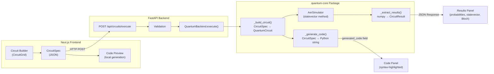
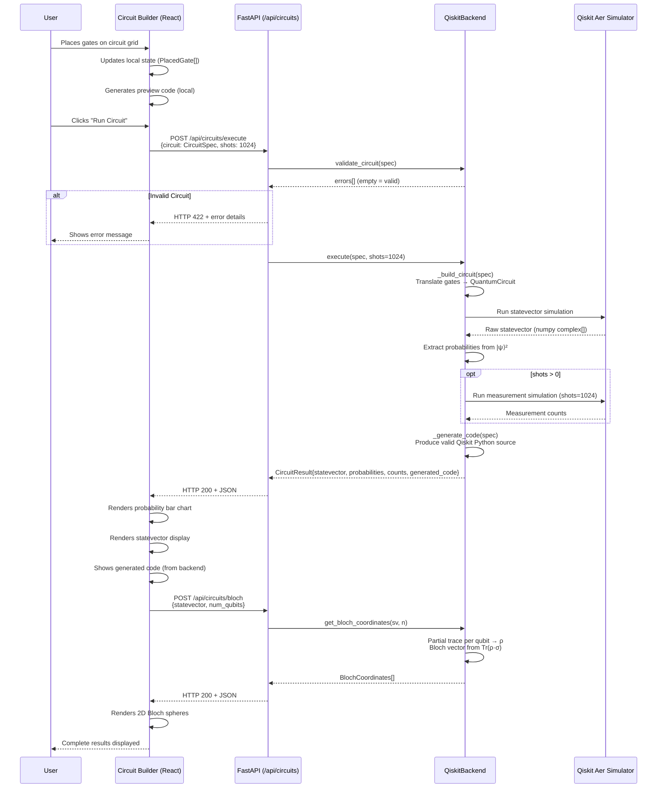
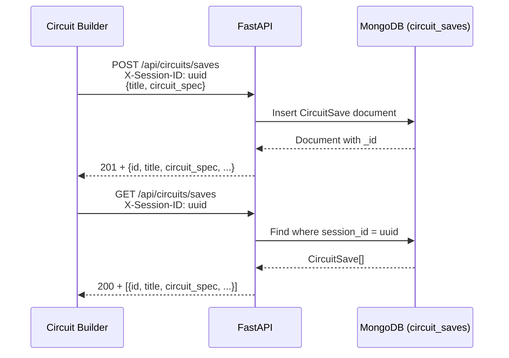

# Circuit Execution Pipeline

**Module:** Circuit Playground (Phase 1)
**Owner:** Aman Raza
**Last Updated:** July 2026

---

## Overview

This document explains the complete flow when a user builds and runs a quantum circuit in Qwearn's Circuit Playground — from the drag-and-drop UI through the backend simulator and back to the results display. It is the single source of truth for understanding how the circuit execution pipeline works.

The pipeline is deliberately **SDK-agnostic at the API boundary**. The frontend and API layer never import Qiskit directly — they operate on a framework-agnostic `CircuitSpec` format. Only the backend implementation (`QiskitBackend`) touches Qiskit code. This is the core architectural decision that enables future multi-SDK support (see ADR-0005).

---

## Architecture Diagram



---

## Sequence Diagram



---

## Data Flow

### 1. CircuitSpec (Frontend → Backend)

The circuit is represented as a framework-agnostic JSON object:

```json
{
  "num_qubits": 2,
  "gates": [
    {"gate": "H", "qubits": [0]},
    {"gate": "CX", "qubits": [0, 1]}
  ]
}
```

Key design decisions:
- **Gate names** follow standard textbook notation (Nielsen & Chuang): X, Y, Z, H, S, T, Phase, CX, CZ, CCX, SWAP
- **Qubit indices** are 0-based, with qubit 0 as least-significant bit (Qiskit convention)
- **Gate ordering** in the array = temporal ordering (first gate applied first)
- **No SDK-specific types** cross the API boundary — everything is plain JSON

### 2. CircuitResult (Backend → Frontend)

```json
{
  "statevector": [[0.707, 0.0], [0.0, 0.0], [0.0, 0.0], [0.707, 0.0]],
  "probabilities": {"00": 0.5, "11": 0.5},
  "counts": {"00": 512, "11": 512},
  "generated_code": "from qiskit import QuantumCircuit\n...",
  "backend_name": "qiskit-aer"
}
```

- **Statevector**: Complex amplitudes as `[real, imag]` pairs. Length = 2^num_qubits.
- **Probabilities**: Only non-zero entries included (threshold: 1e-10).
- **Counts**: Shot-based measurement results. Empty if `shots=0`.
- **Generated code**: Valid, copy-pasteable Python source code.

### 3. BlochCoordinates (Backend → Frontend)

```json
[
  {"qubit_index": 0, "x": 0.0, "y": 0.0, "z": 0.0, "theta": 0.0, "phi": 0.0},
  {"qubit_index": 1, "x": 0.0, "y": 0.0, "z": 0.0, "theta": 0.0, "phi": 0.0}
]
```

For entangled states, the Bloch vector length < 1 (inside the sphere). This is physically correct — the reduced density matrix is mixed.

---

## Code Generation Strategy

The `_generate_code()` method produces valid Python that can be copy-pasted into a Jupyter notebook:

```python
from qiskit import QuantumCircuit
from qiskit_aer import AerSimulator

# Create a 2-qubit circuit
qc = QuantumCircuit(2)

# Apply gates
qc.h(0)
qc.cx(0, 1)  # CNOT: control=0, target=1

# Simulate
qc.save_statevector()
simulator = AerSimulator(method='statevector')
result = simulator.run(qc).result()
statevector = result.get_statevector(qc)

# Print results
print('Statevector:', statevector)
print('Probabilities:', statevector.probabilities_dict())
```

This is a **key learning feature**: users see real Qiskit code that produces the exact same circuit they built visually. The code generation happens server-side (not client-side) so it uses the backend's actual SDK, ensuring the code is always correct and runnable.

---

## Bloch Sphere Computation

For each qubit, we compute the reduced density matrix by partial trace:

1. **Reshape** the statevector into a tensor with one axis per qubit
2. **Compute** the reduced density matrix ρ by tracing out all other qubits
3. **Extract** Bloch coordinates: `x = Tr(ρ·σₓ)`, `y = Tr(ρ·σᵧ)`, `z = Tr(ρ·σᵤ)`

The partial trace accounts for Qiskit's LSB convention (qubit 0 = last tensor axis).

For a pure single-qubit state `|ψ⟩ = cos(θ/2)|0⟩ + e^{iφ}sin(θ/2)|1⟩`:
- `|0⟩` → north pole (0, 0, 1)
- `|1⟩` → south pole (0, 0, -1)
- `|+⟩` → equator (1, 0, 0)

Reference: Nielsen & Chuang §1.2, §2.4.3

---

## Circuit Save/Load (Persistence)

Circuits can be saved to MongoDB via the `/api/circuits/saves` endpoints:



In Phase 1, saves are **anonymous** — identified by a client-generated UUID in `localStorage`. When auth is added in Phase 8, anonymous saves will be migrated to user accounts.

---

## Security Considerations

1. **No arbitrary code execution.** The API accepts **structured circuit specs** (JSON with gate names and qubit indices), not code strings. The CircuitSpec is validated by Pydantic before reaching the backend.

2. **Validation before execution.** Every circuit is validated (`validate_circuit()`) before being executed. Checks include qubit bounds, gate arity, duplicate qubits, and required parameters.

3. **Qubit count limits.** CircuitSpec enforces `num_qubits ∈ [1, 20]`. This caps the statevector size at 2²⁰ = ~1M complex numbers, preventing memory exhaustion.

4. **No user-submitted code.** The `generated_code` field is **output only** — users can copy it, but it's never executed by the server. The circuit always goes through the structured spec → Qiskit translation path.

---

## File Reference

| File | Purpose |
|---|---|
| `packages/quantum-core/quantum_core/backend.py` | Abstract QuantumBackend interface + data models |
| `packages/quantum-core/quantum_core/qiskit_backend.py` | Qiskit/Aer implementation |
| `apps/api/app/routers/circuits.py` | FastAPI endpoints for circuit execution |
| `apps/api/app/routers/saves.py` | FastAPI endpoints for circuit save/load |
| `apps/api/app/models/circuit_save.py` | Beanie document model for saved circuits |
| `apps/web/src/lib/api.ts` | Frontend API client |
| `apps/web/src/app/playground/page.tsx` | Playground page (main orchestrator) |
| `apps/web/src/components/circuit/CircuitGrid.tsx` | Visual circuit editor |
| `apps/web/src/components/circuit/GatePalette.tsx` | Gate selection sidebar |
| `apps/web/src/components/circuit/CodePanel.tsx` | Generated code display |
| `apps/web/src/components/circuit/ResultsPanel.tsx` | Results visualization |
| `apps/web/src/components/circuit/SaveLoadPanel.tsx` | Circuit persistence UI |
| `apps/web/src/components/circuit/CircuitExamples.tsx` | Pre-built circuit presets |

---

## Related Documents

- [ADR-0005: Quantum Backend Interface](../adr/ADR-0005-quantum-backend-interface.md) — Why the interface exists and how it works
- [ADR-0004: MongoDB Access Pattern](../adr/ADR-0004-mongodb-access-pattern.md) — Why Beanie ODM
- [IMPLEMENTATION_PLAN.md](../../IMPLEMENTATION_PLAN.md) — Full build plan with phase breakdown
