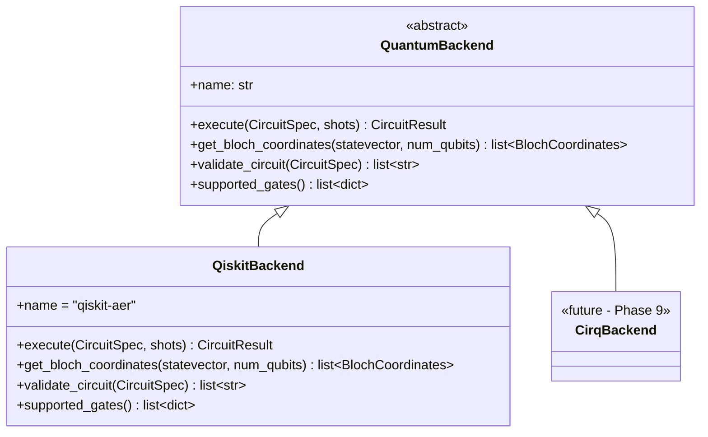
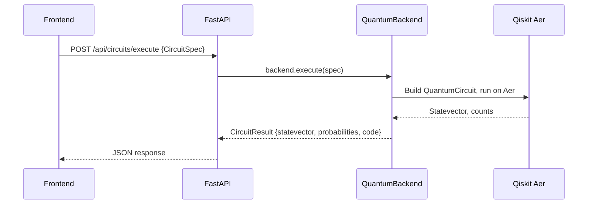

# packages/quantum-core — Quantum Execution Engine

The core quantum computing abstraction layer for Qwearn. This package defines the `QuantumBackend` interface and provides the Qiskit implementation.

## Why This Package Exists

The Circuit Playground lets users build quantum circuits in a drag-and-drop UI. When they click "Run," the circuit needs to be:

1. **Translated** from a generic "circuit spec" (list of gates + qubit indices) into a real Qiskit `QuantumCircuit`
2. **Executed** on the Qiskit Aer simulator
3. **Returned** as statevectors, probabilities, measurement counts, and the generated Qiskit source code

This package handles all of that, behind a clean abstract interface (`QuantumBackend`) so that:
- The API layer (FastAPI) never imports Qiskit directly
- A future Cirq or PennyLane backend can be added by implementing the same interface (Phase 9)

## Architecture



## Data Flow



## Key Files

| File | Purpose |
|---|---|
| `quantum_core/backend.py` | Abstract `QuantumBackend` interface + data models (`CircuitSpec`, `CircuitResult`, `GateSpec`, `BlochCoordinates`) |
| `quantum_core/qiskit_backend.py` | Qiskit implementation (Phase 1) |
| `tests/test_backend.py` | Unit tests for data models |

## Quantum Conventions

All conventions follow **Nielsen & Chuang, "Quantum Computation and Quantum Information"**:

- **Gate names:** X, Y, Z, H, S, T, Phase, CX (CNOT), CZ, CCX (Toffoli), SWAP
- **Qubit ordering:** Least-significant bit = qubit 0 (Qiskit convention)
- **Statevector format:** List of `[real, imag]` pairs, JSON-serializable
- **Basis states:** Computational basis ordered |0...0⟩ to |1...1⟩

⚠️ **Convention Warning:** Cirq uses most-significant-bit = qubit 0 (opposite of Qiskit). A future Cirq backend MUST translate qubit ordering at the interface boundary.

## Development

```bash
cd packages/quantum-core
python3 -m venv .venv
source .venv/bin/activate
pip install -e ".[dev]"
pytest
```

## See Also

- [ADR-0005: QuantumBackend Interface Design](../../docs/adr/ADR-0005-quantum-backend-interface.md)
- [Circuit Execution Pipeline](../../docs/architecture/circuit-execution-pipeline.md) (Phase 1)
